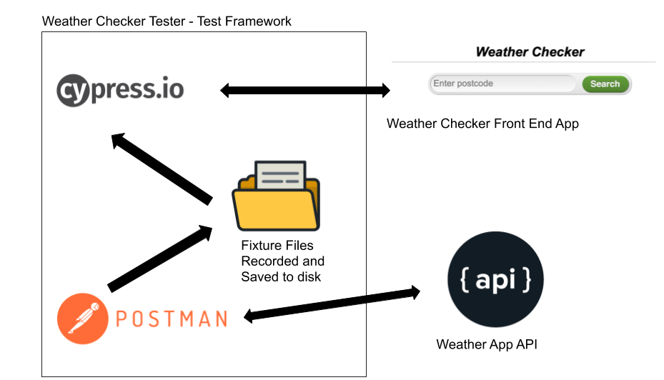

# Weather Checker App Tester

 
Weather Checker Tester is a testing framework for testing the [Weather Checker app](https://serene-mountain-14043.herokuapp.com/)
 
 
The framework uses [Cypress](https://www.cypress.io/) to test the requirements of the Front End app. There is a feature file that outlines the different scenarios for the app in the root of the project.
 
In order to maintain quick stable feedback I've chosen to stub responses that come from the Weather App API. To guarantee any contract changes from the backend are reflected in the tests, I've created a Postman collection. This is used along with Postman's [Newman NPM module](https://www.npmjs.com/package/newman), to record and save the responses before the Cypress tests are run, ensuring that the fixture files used to stub the requests are uptodate.
 
 
## Usage
 
The only dependecy you need to run the framework is [Docker](https://docs.docker.com/engine/install/)

Then you'll just need to build the Docker image and run the tests.
 
`docker-compose build tests && docker-compose run tests`
 
## Installation
 
You'll need Node v12 installed locally if you'd like to work on the framework and run it on your local machine.
 
`npm i`
 
Then to record the fixtures run `npm run record-fixtures`
 
And to run the tests in the terminal `npm run cypress:run` or in the Cypress UI `npm run cypress:open`
 
 
## Running in a CI pipeline
 
Once a Pull Request for the Weather App API is merged into master the last job in the API pipeline will be to
checkout the Weather Checker Tester, run `npm run record-fixtures` and commit the new fixture files back into this repository.
 
This will kick off a CI build on the Weather Checker Tester, which will run the tests `npm run cypress:run` using the new fixture files.
The last job in the Weather Checker Tester pipeline will be to commit a new release using the same version tag used in the Weather App API build. So we have a tracked and versioned history of the changes to the API in this repo and a record of passing acceptance criteria to API version.
 
 

